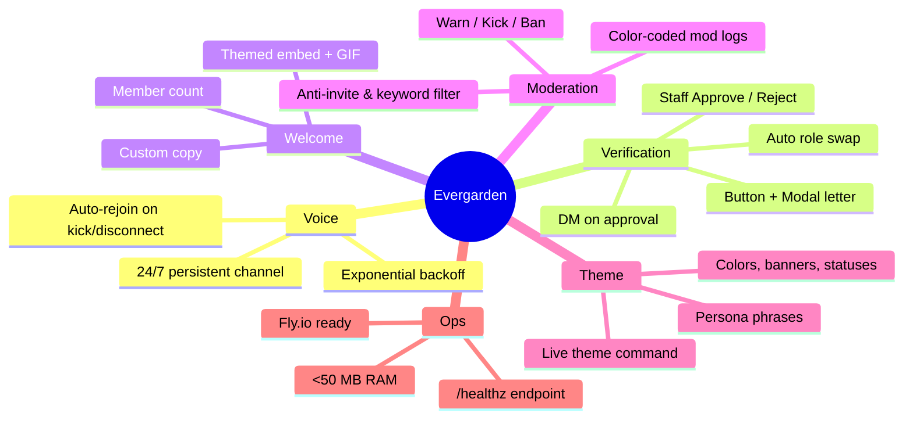
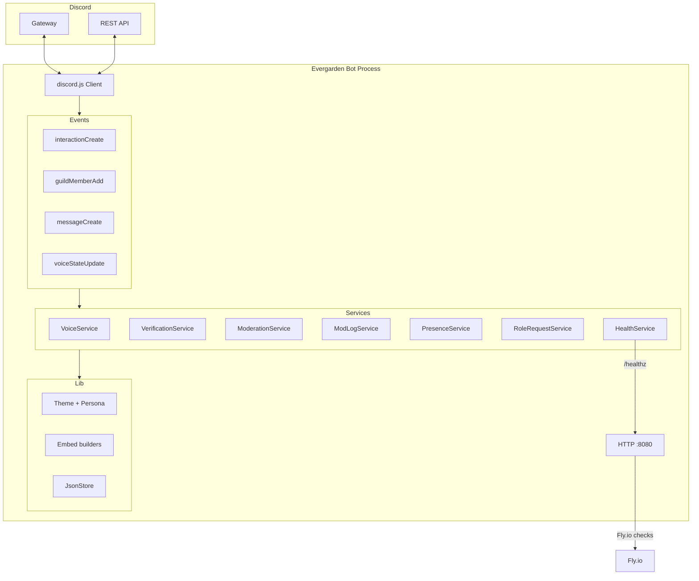
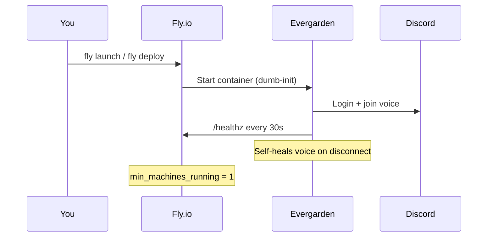

<div align="center">

# ✉️ Evergarden

**An Auto Memory Doll for your Discord server.**

*Write letters. Welcome guests. Keep the voice channel alive.*  
A free-to-run, beautiful, production-ready Discord bot in TypeScript.

[](https://www.typescriptlang.org/)
[](https://discord.js.org/)
[](https://fly.io/)
[](LICENSE)
[](https://nodejs.org/)

<br/>

*Lightweight • Themed • Self-healing • Under ~50 MB RAM*

</div>

---

## 🌸 Why Evergarden?

Most Discord bots are either bloated frameworks or bare-bones scripts.  
Evergarden is different:

| Goal | How Evergarden delivers |
|------|-------------------------|
| **Free to run** | Designed for Fly.io free tier (or any tiny VPS). Auto-stop disabled, health checks, ~50 MB RSS. |
| **Beautiful** | Custom theme system, letter-inspired copy, rich embeds, rotating status. |
| **Helpful** | Verification portal, welcome letters, moderation tools, role requests, 24/7 voice presence. |
| **Reliable** | Self-healing voice, anti-crash handlers, mod logs, graceful restarts. |
| **Portfolio-ready** | Clean TypeScript, modular services, Docker multi-stage, VS Code + Dev Container. |

> Inspired by the *Auto Memory Doll* — a professional who writes and delivers letters for those who cannot.

---

## ✨ Features



### Core capabilities

- **24/7 Voice Persistence** — Joins a designated voice channel on boot and heals itself if disconnected or kicked.
- **Staff Verification** — Guests write a short “letter of introduction”. Staff approve/reject with one click.
- **Welcome Letters** — Beautiful embed + optional GIF when a member is verified.
- **Moderation Toolkit** — Slash commands for warn/kick/ban + dedicated color-coded audit channel.
- **Anti-spam basics** — Blocks invites and configurable keywords.
- **Live Theme System** — Change brand name, colors, statuses, welcome text without redeploying (persisted).
- **Health Probes** — Lightweight HTTP server for Fly.io (or any platform) health checks.
- **Production hardening** — Global error handlers, rate-limit logging, graceful signal handling via `dumb-init`.

---

## 🏗️ Architecture



Clean separation: **commands** → **events** → **services** → **lib**.  
No database required — optional JSON store for theme overrides.

---

## 🚀 Quick Start (Local)

### 1. Prerequisites

- Node.js **≥ 20**
- A Discord Application + Bot Token ([Discord Developer Portal](https://discord.com/developers/applications))
- Bot intents enabled: **Server Members**, **Message Content**, **Voice States**

### 2. Clone & install

```bash
git clone https://github.com/Stephanie0i/evergarden-discord-bot.git
cd evergarden-discord-bot
npm install
```

### 3. Configure

```bash
cp .env.example .env
# Edit .env with your token, guild ID, channel IDs, role IDs
```

Key variables (see `.env.example` for full list):

| Variable | Purpose |
|----------|---------|
| `DISCORD_TOKEN` | Bot token |
| `CLIENT_ID` | Application ID |
| `GUILD_ID` | Your server ID |
| `VOICE_CHANNEL_ID` | Channel for 24/7 presence |
| `VERIFY_CHANNEL_ID` | Where the verification button lives |
| `ADMIN_REVIEW_CHANNEL_ID` | Staff review channel |
| `WELCOME_CHANNEL_ID` | Welcome messages |
| `MOD_LOG_CHANNEL_ID` | Audit trail |
| `VERIFIED_ROLE_ID` / `UNVERIFIED_ROLE_ID` | Role swap on approval |

### 4. Register slash commands

```bash
npm run deploy:commands
```

### 5. Run

```bash
# Development (hot reload)
npm run dev

# Production build
npm run build && npm start
```

---

## ☁️ Free Deployment on Fly.io

Evergarden is built to stay under the free-tier memory limit.



### One-time setup

1. Install [flyctl](https://fly.io/docs/hands-on/install-flyctl/) and log in.
2. From the project root:

```bash
fly launch          # follow prompts, use existing fly.toml
fly secrets set DISCORD_TOKEN=your_token CLIENT_ID=... GUILD_ID=... # etc.
fly deploy
```

3. The included `fly.toml` already sets:
   - `min_machines_running = 1`
   - Health check on `/healthz`
   - 512 MB memory (safe headroom; actual usage is much lower)

> **Tip:** Keep the machine always on with `auto_stop_machines = 'off'` (already set). Free allowance is generous for a single small bot.

---

## 📁 Project Structure

```
evergarden-discord-bot/
├── src/
│   ├── commands/          # Slash commands (ping, mod, theme, verify-setup…)
│   ├── events/            # Gateway event handlers
│   ├── services/          # Business logic (voice, verification, mod…)
│   ├── lib/               # Theme, persona, embeds, JSON store
│   ├── config.ts          # Typed env config
│   ├── deploy-commands.ts # Register slash commands
│   └── index.ts           # Entry point
├── .devcontainer/         # One-click Codespaces / VS Code
├── .vscode/               # Launch configs & tasks
├── Dockerfile             # Multi-stage, ~minimal production image
├── fly.toml               # Fly.io config
├── .env.example           # All configuration documented
└── package.json
```

---

## 🎨 Theming & Persona

Everything is written in the voice of an **Auto Memory Doll**.

- Statuses rotate (e.g. “✉️ Writing letters for those who cannot”)
- Error messages, auto-mod replies, and welcome text use original letter-themed phrases
- `/theme` command (admin) lets you change colors, brand name, welcome GIF, statuses live
- Overrides are stored in a simple JSON file (no database)

You can replace the persona entirely by editing `src/lib/persona.ts` and `src/lib/theme.ts`.

---

## 🛡️ Slash Commands (overview)

| Command | Description |
|---------|-------------|
| `/ping` | Latency check (with letter-themed replies) |
| `/help` | Beautiful help embed |
| `/health` | Bot + voice status |
| `/join-vc` | Force rejoin voice channel |
| `/mod` | Warn / kick / ban + reason |
| `/roles` | Role request helpers |
| `/theme` | Live theme editor (admins) |
| `/verify-setup` | Post the verification letter button |
| `/admin` | Admin utilities |

---

## 🧰 VS Code & Dev Containers

Open the folder in VS Code or GitHub Codespaces — the included `.devcontainer` and `.vscode` configs give you:

- One-click debug (`F5`)
- Tasks for build / deploy-commands
- Recommended extensions

---

## 🤝 Contributing

This project is meant to help people run a polished bot **for free**.  
PRs and issues are welcome:

1. Fork → feature branch → PR
2. Keep TypeScript strict and memory-conscious
3. Prefer services over giant command files

See the code comments for architecture notes.

---

## 📜 License

MIT — use it, fork it, theme it for your own server.  
Just keep the spirit: helpful, beautiful, and free to run.

---

<div align="center">

**Made with care, like a carefully written letter.**

*Evergarden — Auto Memory Doll Service*

</div>
